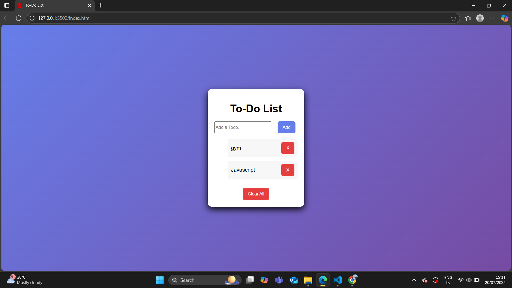

# To-Do List App

A simple and attractive **To-Do List App** built using **HTML, CSS, and JavaScript** with **LocalStorage**.  
This app allows users to **add, mark complete, delete tasks, and persist tasks even after page reload**.

---

## Features
- Add new tasks with one click.  
- Mark tasks as **completed** (line-through effect).  
- Delete individual tasks.  
- **Clear All Tasks** button to remove all tasks.  
- **LocalStorage integration** – tasks remain saved after refreshing.  
- Responsive and clean UI.

---

## Tech Stack
- **HTML5**  
- **CSS3**  
- **JavaScript (ES6)**  
- **LocalStorage**

---

## Live Demo
[Click here to view the live app](https://taskora-netlify.netlify.app/)

---

## Screenshot

todo-list/
│
├── index.html
├── style.css
├── script.js
└── screenshot.png

Author
Jaskaran Singh
Frontend Developer (HTML, CSS, JavaScript)
